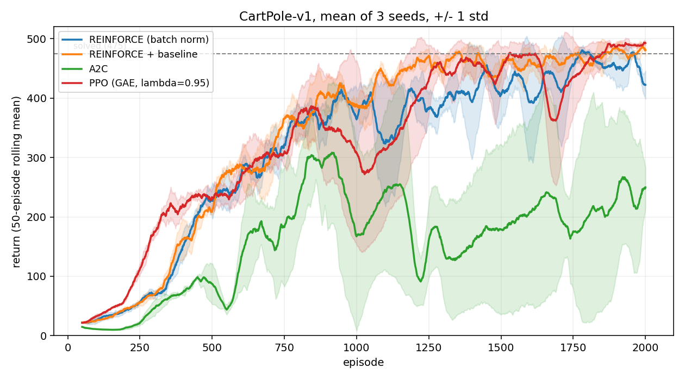

# rl-from-scratch

Policy gradient methods implemented from scratch in NumPy, with every gradient
derived by hand, on CartPole-v1. Four algorithms, each in a single file, built
as a progression: the diff between two consecutive files is the algorithm
changing and nothing else.

No PyTorch, no autograd, no RL library. The backward passes are written out.

## Results

CartPole-v1, 3 seeds, 200 batches of 10 episodes, plain SGD.
Solved means a 50-episode running average of at least 475.
Eval is 20 greedy (argmax) episodes on a held-out seed.

| Algorithm | Solved | Episodes to solve | Final eval | Best eval |
| --- | --- | --- | --- | --- |
| REINFORCE (batch norm) | 3/3 | 1571 +/- 166 | 447 +/- 75 | 498 +/- 2 |
| REINFORCE (episode norm) | 2/3 | 1872 +/- 12 | 407 +/- 132 | 500 +/- 0 |
| REINFORCE + baseline | 3/3 | 1258 +/- 27 | 500 +/- 0 | 481 +/- 27 |
| A2C | 2/3 | 1730 +/- 90 | 224 +/- 159 | 391 +/- 90 |
| PPO (TD advantage) | 0/3 | - | 54 +/- 24 | 165 +/- 28 |
| PPO (GAE, lambda=0.95) | 3/3 | 1320 +/- 128 | 500 +/- 0 | 500 +/- 0 |



"Episodes to solve" averages only over the runs that solved, so read it next to
the Solved column. The REINFORCE (episode norm) figure of 1872 is the mean of
two runs; the third never got there.

Both evaluation numbers are reported on purpose. The best checkpoint alone
flatters a run that peaked and then fell apart, and the final policy alone hides
a run that found a good policy and walked away from it. A2C is the clearest
case: one seed cleared the solve threshold at episode 1639 and finished with a
final eval of 9.4, having destroyed itself in the last 40 batches.

## The four files

| File | What it adds |
| --- | --- |
| `algorithms/reinforce.py` | Vanilla policy gradient. Each timestep weighted by the Monte Carlo return `G_t`. |
| `algorithms/baseline.py` | A learned value network. Advantage is `G_t - V(s_t)`. Still Monte Carlo, the critic only recentres it. |
| `algorithms/a2c.py` | Bootstrapping. Advantage is `r_t + gamma*V(s_{t+1}) - V(s_t)`. The critic now estimates the future instead of watching it. |
| `algorithms/ppo.py` | A probability ratio against the collecting policy, clipping, and 4 epochs over each batch. `--advantage {td,gae}`. |

## Findings

**The advantage estimator mattered more than the clipping.** PPO with a
single-step TD advantage solved 0 out of 3 seeds. The same code with GAE at
lambda=0.95 solved 3 out of 3, same seeds, same hyperparameters, one flag
changed. Clipping bounds how far the policy moves per update, but it cannot fix
the direction: when the critic is wrong, every advantage in the batch is wrong
in a correlated way, and PPO takes four careful steps somewhere bad. Summing
the TD errors over a lambda-horizon cuts that noise, and it is what made PPO
work here.

**Bootstrapping did not pay off on this task.** REINFORCE with a learned
baseline was the most reliable method in the table: 3/3 solved, a spread of 64
episodes across seeds, and it beat both A2C and TD-advantage PPO. That is not
the ordering the algorithm ladder suggests, and the reason appears to be the
task. CartPole episodes are short, so Monte Carlo returns are not especially
noisy, and there is little variance for bootstrapping to remove. What
bootstrapping does add is bias from an undertrained critic, plus a dependency
where the policy cannot learn anything until the critic can tell states apart.
A2C spent its first ~1300 episodes flat at a random-policy return for exactly
that reason.

**Per-episode normalization loses information.** Normalizing returns inside
each episode makes a 500-step episode and a 20-step episode both come out mean
0, standard deviation 1, so the update can no longer tell that one was better
than the other. Only within-episode credit assignment survives. Batch
normalization solved 3/3 against 2/3 and got there roughly 300 episodes sooner.
The gap is smaller than expected, which is worth saying: this is one task and
three seeds, not a general claim.

**PPO costs about 5x the wall time per run.** 58-71 seconds against 12 for
REINFORCE. The other three algorithms cache the activations computed while
acting, since the weights do not move until the batch ends. PPO takes four
passes over the same batch, so those activations are stale after the first
update and the forward pass has to be redone every epoch.

## Reproducing

```bash
pip install -r requirements.txt

python algorithms/reinforce.py        # a single run of one algorithm
python experiments/run_all.py         # every config, 3 seeds, writes results/
```

`run_all.py` writes `results/runs.csv` (one row per run) and
`results/curves.csv` (one row per episode) and prints the table above.

Runs are reproducible. Three separate RNG sources have to be pinned for that to
hold: the environment's reset RNG, the action space sampler, and the policy's
own sampling RNG. Seeding only the last is the easy mistake, because it looks
seeded and is not.

## Scope

One environment, 16-unit hidden layers, plain SGD with no momentum or Adam, no
parallel environments, no entropy bonus, no learning rate schedule. The
hyperparameters were tuned per algorithm but not exhaustively, so the table
compares four implementations at a reasonable setting rather than four
algorithms at their best.
